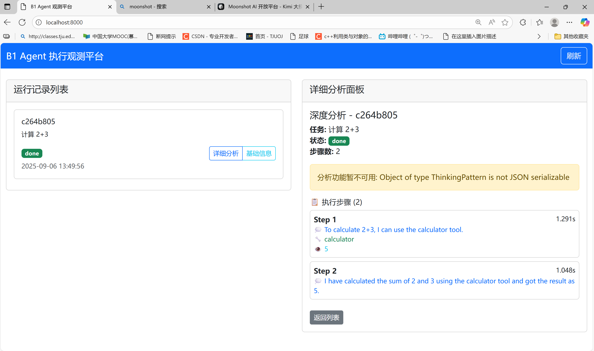

# Kimi B1 React Engine Project

本项目是最新版本 *v3.0*，之前尝试的两个版本 *v1.0* 和 *v2.0* 可以在不同的branch中找到。
一个基于 ReAct 模式的 AI Agent 框架，支持工具调用、轨迹记录和批量执行。

## 效果图

## 🚀 快速开始

### 1. 测试项目
```bash
python main.py test
```

### 2. 安装依赖
```bash
pip install -r requirements.txt
```

### 3. 配置环境变量
```bash
cp .env.example .env
# 编辑 .env 文件，填入你的 API 密钥
```

### 4. 运行示例

#### 单任务执行
```bash
python main.py b1 --task "计算 2+3*4"
```

#### 批量任务执行
```bash
python main.py b2 --cases cases/cases.jsonl
```

#### 启动后端服务
```bash
python main.py server
# 访问 http://localhost:8000
```

#### 运行评估
```bash
python main.py eval --runs runs --cases cases/cases.jsonl
```

## 📁 项目结构

```
repo/
├── main.py                 # 主入口脚本
├── test_project.py        # 项目测试脚本
├── requirements.txt       # 依赖列表
├── .env.example          # 环境变量示例
├── README.md
├── LICENSE
│
├── src/                   # 核心源代码
│   ├── b1_cli.py         # B1 单任务执行
│   ├── b2_runner.py      # B2 批量并发执行
│   ├── b2_eval.py        # 自动评分与汇总
│   └── core/             # 核心模块
│       ├── react_engine.py    # ReAct 引擎
│       ├── model_adapter.py   # 模型适配器
│       ├── toolbus.py         # 工具总线
│       ├── tools_local.py     # 本地工具
│       ├── trace.py           # 轨迹记录
│       ├── sink.py            # 数据输出
│       └── visualize.py       # 可视化生成
│
├── backend/               # 可选后端服务
│   ├── app.py            # FastAPI 应用
│   ├── store.py          # 数据存储
│   ├── schemas.py        # 数据模型
│   └── static/
│       └── index.html    # 前端界面
│
├── cases/                 # 测试用例
│   └── cases.jsonl       # 批量测试用例
│
├── policies/              # 策略配置
│   ├── v1.yaml           # 基础策略
│   └── v2.yaml           # 增强策略
│
├── runs/                  # 输出目录
│
└── scripts/               # 快速启动脚本
    ├── quickstart_b1.sh
    └── batch_demo_b2.sh
```

## 🔧 功能特性

### 核心功能
- **ReAct 引擎**: 支持 Thought-Action-Observation 循环
- **多模型支持**: Kimi/OpenAI/Claude 等（可扩展）
- **工具系统**: 计算器、文件操作、网络搜索等
- **轨迹记录**: 完整的执行过程记录
- **批量执行**: 支持并发处理多个任务
- **自动评估**: 基于规则的评分系统

### 安全特性
- 工具调用白名单机制
- 文件操作路径限制
- API 密钥脱敏处理
- 执行时间限制

### 可视化
- HTML 报告生成
- 实时进度追踪
- 指标统计和分析

## 📊 使用示例

### 单任务示例
```python
from src.core.react_engine import ReactEngine, ReactConfig
from src.core.model_adapter import KimiAdapter
from src.core.toolbus import LocalBus

# 创建引擎
model = KimiAdapter()
tools = LocalBus(allow=["calculator", "read_file"])
config = ReactConfig(max_steps=10)
engine = ReactEngine(model, tools, config)

# 执行任务
trace = engine.run("计算 fibonacci(10)")
print(f"结果: {trace.final_answer}")
```

### 批量任务示例
```jsonl
{"id": "calc_1", "prompt": "计算 2+3", "expect": {"must_contain": ["5"]}}
{"id": "calc_2", "prompt": "计算 10*5", "expect": {"must_contain": ["50"]}}
```

## 🛠️ 开发

### 运行测试
```bash
python main.py test
```

### 代码检查
```bash
python -m py_compile src/**/*.py
```

### 启动开发服务器
```bash
python main.py server
```

## 📝 配置说明

### 策略配置 (policies/v1.yaml)
```yaml
version: "1.0"
name: "基础策略"
model: "moonshot-v1-8k"
temperature: 0.2
max_steps: 8
security:
  allowed_tools: ["calculator", "read_file", "write_file"]
  max_execution_time: 300
```

### 环境变量 (.env)
```env
# Kimi API 配置（主要使用）
KIMI_API_KEY=your_kimi_api_key_here
MOONSHOT_API_KEY=your_kimi_api_key_here
KIMI_BASE_URL=https://api.moonshot.cn/v1

# OpenAI 配置（备用）
OPENAI_API_KEY=your_openai_api_key_here
LOG_LEVEL=INFO
OUTPUT_DIR=runs
```

## 🤝 贡献

欢迎提交 Issue 和 Pull Request！

## 📄 许可证

MIT License
